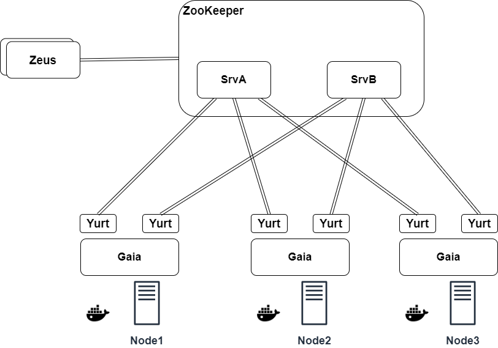
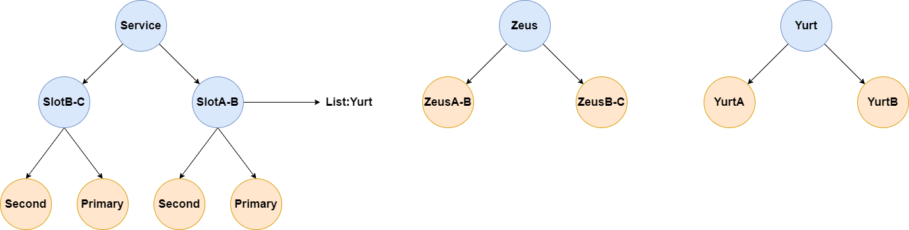
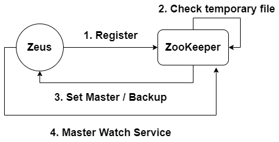
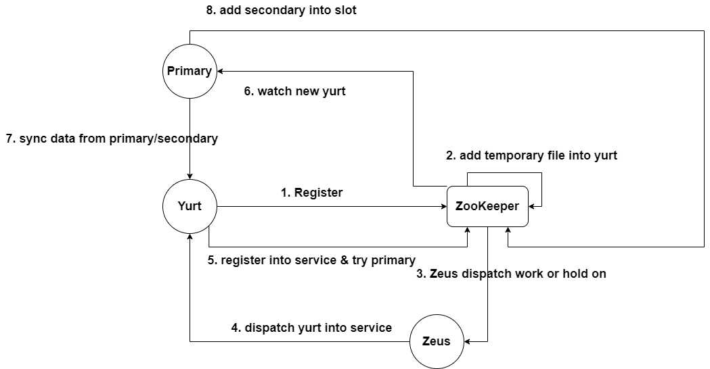
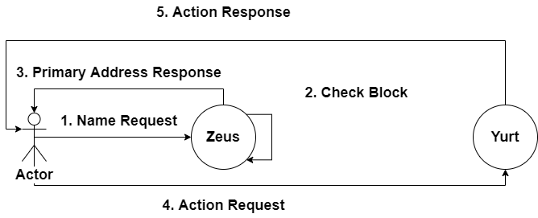
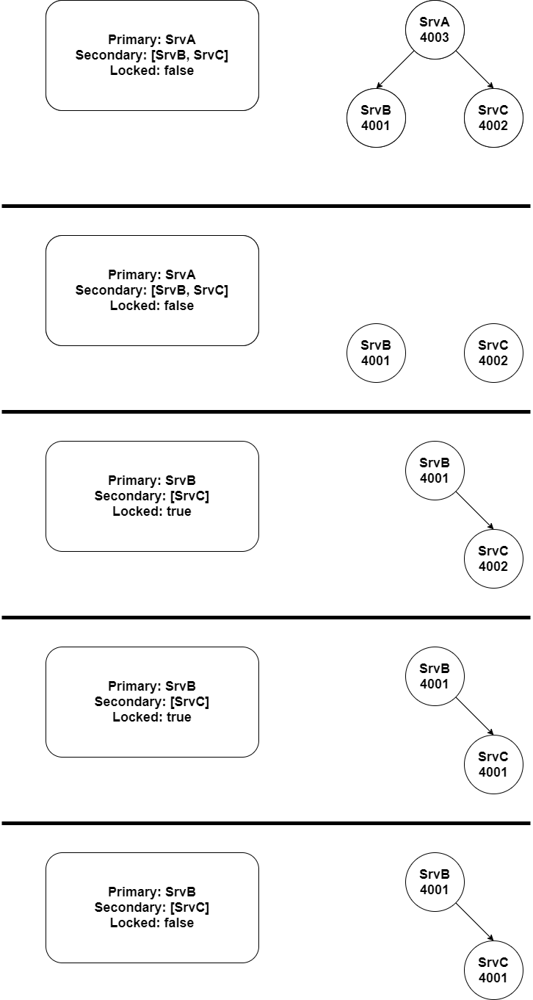
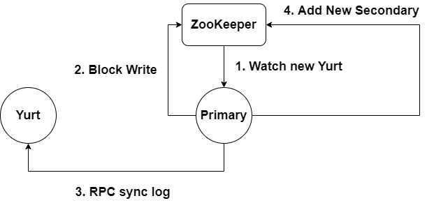
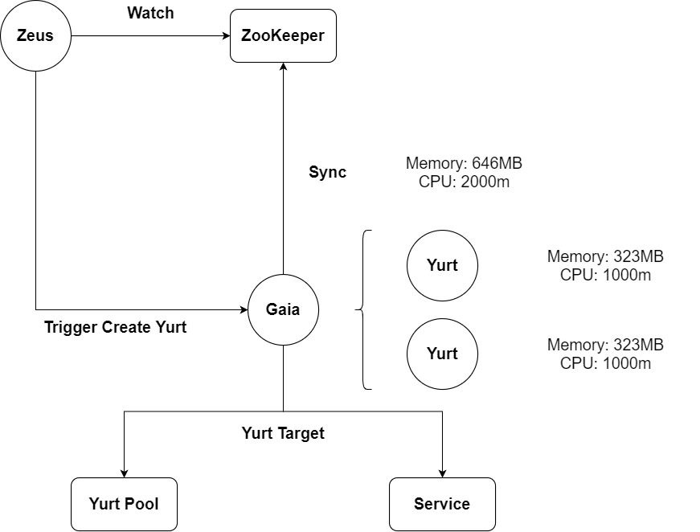
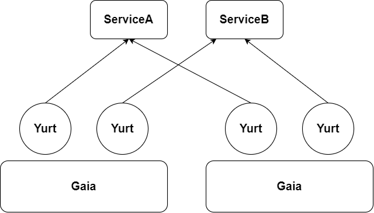

#  ThunderYurts 架构设计

ThunderYurts 的是一个保证最终一致性的分布式存储

Zeus 作为 Coordinator 的角色出现负责主要控制平面，并不做任何键值对的存储工作，并且所有的状态在内存中进行 Cache，存储在 ZooKeeper 中（即出现故障也可以从 ZooKeeper 中恢复），从而实现 stateless，能够更加方便的实现 Zeus 的多种模式，使得架构 Scalability 和 Availability 能得以提升。

Yurt 是实际存储键值对的数据平面，具体负责数据的存储，数据的转移，能够使用主从模式，从而提升 Availability 和 Performance。

我们将 ZooKeeper 直接暴露给 Yurt， 而不是让 Zeus 当做中间人，是认为在该系统中 ZooKeeper 的数据是一等公民，这样能够简化 Zeus 的相关工作。Zeus能够通过 Watch Yurt 的状态从而进行相应的操作。Yurt 能通过 ZooKeeper 明确自己工作的域，能够 Watch 到自己被分配的工作。

Gaia 的主要作用是将 Docker 封装，监控 Node 上资源的情况，可以引导 Zeus 进行相应的调度工作。例如，Zeus 发现访问压力过大，需要更多的 Yurt 来进行负载均衡，则可以选择调用 Gaia 的接口进行新 Yurt 进行创建，为 Yurt Pool 增添更多的资源。 

## ZooKeeper znode 的数据结构设计

为配合相关功能的实现，需要对znode进行相关设计。

Service znode 下主要是存储不同的 slot 的归属，记录 Primary 和 Secondary 分别有什么，Primary 会监控当前 znode 下是的 Seond 是否有增添或减少的情况。Zeus 则是会监控和分配对应范围内的 Service 中是否存在 Primary。

Zues 下的内容是为了 Zues 的 Master Backup 而设计。

Yurt 下的内容是记录向 Zeus 注册的内容，此时 Yurt 没有特化，不属于任何的 Service。 

## Service Discovery

分别讲一讲 Zeus，Yurt，Gaia 的 Service Discovery

**Zeus**: Zeus 启动时将注册到具体的 ZooKeeper 服务中，首先抢占式的创建一个 Ephemeral Node，从而实现选举，如果已经创建，则 Zeus 实例将成为 Backup，阻塞在此，等待 Master 实例出现故障或网络问题，则将自己变为 Master。

Zeus Master 在初始化时首先需要同步 ZooKeeper ，恢复相应的 Watcher， 将部分数据同步到相应的 Config 中，例如 Slot 的（预）分配情况，Service 当前的服务状况。

**Yurt**：Yurt 在 Register 时并不知道自己会被分配到什么样的工作，因此注册工作对于 Yurt 而言只是创建一个 Ephemeral Node，并等待 Zeus 分配工作。在 Zeus 作出 最终决定之后，首先将会在 Yurt 注册使用的 Ephemeral Node 中写入该 Yurt 将被分配到具体的 Service。该 Yurt 会 Watch 到改数据，并立即删除该 Ephemeral Node，进行下一步的 ServiceRegister。ServiceRegister 将会在对应的 Service znode 中创建相应的 注册 Ephemeral Node，此时 Yurt 中无任何数据，之后该 Yurt 进入到 Primary 的抢夺中。详细的 Primary Secondary 工作细节会在后续的章节中深入探讨。Primary 会 watch 服务下的子节点，如有 Secondary 的 Ephemeral Node 被删除，则会删除 Secondary 字段对应的内容。

**Gaia**：Gaia 的注册类似于 Yurt 的 Register 在 Gaia 节点下创建临时节点，并且在创建之时就上传自己的节点信息。

## Load Balance

首先描述 ThunderYurts 的请求架构，一个请求(READ/PUT/DELETE)首先会通过 IP 直接访问 Zeus 服务，Zeus 服务将会通过一致性 Hash 计算找到对应的服务，服务将返回对应服务的 IP 给到客户端，客户端再次请求服务，进行相应的操作。

一共从三个层面设计负载均衡。Zeus 层面，对于 READ，在具体的服务中，将 READ 按照一定的算法分配给 Secondary 或 Primary。服务层面，利用类似 Redis 虚拟槽的方式，将虚拟槽分配给不同的服务，实现数据层面的负载均衡。资源层面， Gaia 将及时定时反馈 Yurt 宿主机上的资源，能够有效的提供信息，让 Zeus 选择合适的 Node 创建 Yurt，从而在带宽资源、端口资源、存储资源方面做到了负载均衡。

## Service Self Manage

我们需要强调是，在 ThunderYurts 中 Service是有一定的 自主调控能力的，并最终将自主调控的结果将通过 Service 反馈给 Zeus（Zeus 会对管理的 Service 进行 Watch），Service 中存在 Primary, Secondary 的职责分配，Primary 负责读写操作，并且提供 Sync Server 供所有的 Secondary 进行同步，Secondary 负责读操作，并从 Sync Server 不断获取到新的 Log 实现主从同步，并持续观察 Service 以同步 Master。

自主调控主要体现在主从切换和服务发现两个方面。

**主从切换**：当 Service 的 Primary 发生崩溃的情况下，因为所有的 Secondary 都在以抢占式地创建同样的 Ephemeral Node，因此 Secondary 中的某一位会重新成为 Primary，作如下处理：
1. 将该Service 设置为 Locked，即不向外提供写操作
2. 修改 Primary 为新的 Host
3. 所有的 Secondary 向新 Primary 发送 Sync 请求，建立长连接
4. Secondary 同步到新 Primary 的 Log，此时可能会出现 UNDO 的情况（抢到 Primary 的服务可能并不是 Log 更新最新的一个）

**服务发现**：当 Service 中有 Secondary 丢失连接，则 Primary 需要修改 Service 的 Secondary 字段以通知 Zeus 进行更新。

## Data Transform

这里主要考虑的内容是如何进行 Primary 和 Secondary 的同步工作，在此我们决定使用的是使用 RPC 长连接来同步 Log，在 Secondary 上同步 Log，这个设计的灵感来源于 MySQL 的主从模式，并且比较容易能够添加 Secondary，支持在初始化之后添加 Secondary 和初始化时固定 Secondary 需要对初始化 Secondary 进行考虑。目前初步的考虑我们将对服务的 PUT/DELETE 操作进行锁死，将 Primary 数据通过 RPC 同步到新的 Secondary，当同步完成之后，Primary 会修改 ZooKeeper 状态，在 Secondary 数据中添加一个新的 Secondary 地址。

## Fault Tolerance

从 Fault Tolerance 的角度而言，ThunderYurts 主要考虑的是三个层次，Zeus 层次主要考虑 master-backup 模型，能够克服单点故障。Service 的层次主要能够对不同的 Slots 进行分流，如果部分的服务崩溃，只要 Zeus 没有全盘崩溃，则其余服务能够继续对外提供服务，Yurt 层次主要考虑使用 master-slave 模型，能够克服单点故障。

## Yurt Pool
Yurt Pool 用于两个方面，首先是在访问压力不大的情况下，能够形成资源池，以供极速调配到不同的 Service 下作为 Secondary 提升 QoS，另一方面可以接纳因为短期网络波动造成的 Yurt 脱离 Service，可以进入到 Yurt Pool 以待进一步分配。

## Dynamic Scalability

动态扩展主要通过 Gaia 和 Zeus 进行配合实现，主要有 direct 和 indirect 两种模式。Gaia 将不断上报本地资源的情况，是 Zeus 对服务进行扩展的基础。

direct: 直接远程调用 Gaia 直接启动新 Yurt 注册到指定的服务，以定向保证性能和可靠性。

indirect: 间接调用 Gaia 启动新 Yurt 进入到的 Yurt Pool 以待被调度。

同时 Gaia 会提供本节点上服务的ip+port，Zeus 考虑到将同一个的 Service 的 Yurt 分配到不同的 Node 上，以避免 Node 崩溃导致整个服务直接崩溃。

