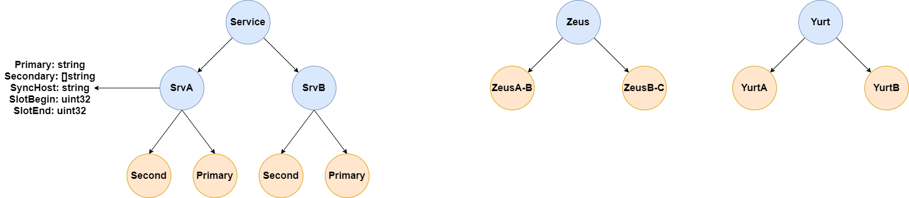

#  ThunderYurts 架构设计

Zeus 作为 Coordinator 的角色出现负责控制平面，并不做任何键值对的存储工作，并且所有的状态并不在内存和文件中进行存储，而是存储在 Zookeeper 中，从而实现stateless，能够更加方便的实现 Zeus 的多种模式，使得架构  Scalability 和 Availability 能得以提升。

Yurt 是实际存储键值对的数据平面，具体负责数据的存储，数据的转移，能够使用主从模式，从而提升 Availability 和 Performance。

我们将 Zookeeper 直接暴露给 Yurt， 而不是让 Zeus 当做中间人，是认为在该系统中 Zookeeper 的数据是一等公民，这样能够简化 Zeus 的相关工作。Zeus能够通过 Watch Yurt 的状态从而进行相应的操作。Yurt 能通过 Zookeeper 明确自己工作的域，能够 Watch 到自己被分配的工作。

## ZooKeeper znode 的数据结构设计

为配合相关功能的实现，需要对znode进行相关设计。

Service znode 下主要是存储不同的 slot 的归属，记录 Primary 和 Secondary 分别有什么，Primary 会监控当前文件夹下是的 Seond 是否有增添或减少的情况。Zeus则是会监控对应范围内的 Slot 中是否存在 Primary。

Zues 下的内容是为了Zues 的master backup 而设计。

Yurt 下的内容是记录向 Zeus 节点注册的内容，此时 Yurt 没有特化，不属于任何的 Slot。 

## Service Discovery

分别讲一讲 Zeus 和 Yurt 的 Service Discovery

**Zeus**: Zeus 启动时将注册到具体的Zookeeper服务中，首先check是否有人已经创建了相应的临时文件，如果已经创建，则 Zeus 实例将成为backup，阻塞在此，等待 master 实例出现故障或网络问题，则将自己变为master。

**Yurt**:  Yurt 在注册时并不知道自己会被分配到什么样的工作，因此注册工作对于Yurt 而言只是创建一个临时节点，并等待 Zeus 分配工作。在 Zeus 作出 最终决定之后，首先将会在 Yurt 节点中写入该 Yurt 负责什么工作（虚拟槽的数量，是 primary 还是 secondary）。这个消息，该 Yurt 节点会 Watch 到改数据，该工作的 Primary 节点也能够知晓被分配了相应的节点，会在对应的 Slot 下创建自己的临时节点以向 Primary 注册，随后进行数据的同步工作（log的redo）。

## Load Balance

首先描述ThunderYurts的请求架构，一个请求(GET/PUT/DELETE)首先会通过IP直接访问 Zeus 服务，Zeus 服务将会通过一致性 Hash 计算找到对应的服务，服务将返回对应服务的 IP 给到客户端，客户端再次请求服务，进行相应的操作。

一共是两层负载均衡，首先是数据的分布。利用类似 Redis 虚拟槽的方式，将虚拟槽分配给不同的服务，实现数据层面的负载均衡，其次是在具体的服务中的负载均衡，对于 GET，在具体的服务中，将 GET 按照一定的算法分配给 Secondary 或 Primary。

## Data Transform

这里主要考虑的内容是如何进行 Primary 和 Secondary 的同步工作，在此我们决定使用的是使用rpc长连接来同步log，在 Secondary 上同步log，这个设计的灵感来源于 MySQL 的主从模式，并且比较容易能够添加 Secondary，支持在初始化之后添加 Secondary 和初始化时固定 Secondary 需要对初始化 Secondary 进行考虑。目前初步的考虑我们将对服务的PUT/DELETE操作进行锁死，将 Primary 数据通过 RPC 同步到新的 Secondary，当同步完成之后，Primary 会修改 Zookeeper 状态，在 Secondary 数据中添加一个新的 Secondary 地址。

