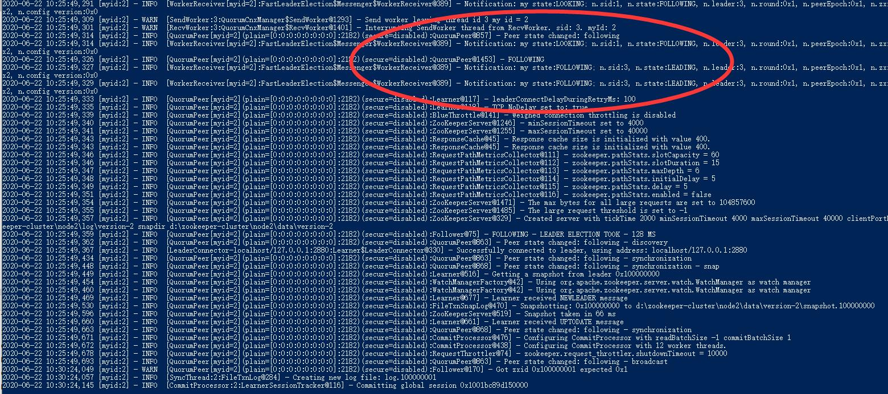

# zookeeper集群配置

zookeeper的主要步骤分为二进制文件下载，配置文件修改，添加myid，启动集群

**二进制文件下载**：下载[最新版本的zookeeper](https://mirrors.tuna.tsinghua.edu.cn/apache/zookeeper/zookeeper-3.6.1/apache-zookeeper-3.6.1-bin.tar.gz)可执行jar包,并将文件解压
**配置文件修改**：默认情况下zookeeper的配置文件是适配zookeeper的单机启动，因此需要修改zookeeper的默认配置文件，主要关注的配置为:
```cfg
dataDir=d:\\zookeeper-cluster\\node1\\data
dataLogDir=d:\\zookeeper-cluster\\node1\\log 
# the port at which the clients will connect
clientPort=2181
server.1=localhost:2887:3887
server.2=localhost:2888:3888
server.3=localhost:2880:3889
```
在此我们以node1位例子，会看到我们使用了node1文件夹，其下的data和log文件夹分别管理文件和log的存储，另外就是clientPort的配置，该端口的配置与用户的使用息息相关，关于server.x是有关于zookeeper cluster的重要配置，用于标识其他的zookeeper实例端口，使能实例之间的联系。
此外为了方便启动单个实例，我们修改了zkServer.cmd，并使用了三份。
```cmd
setlocal
call "%~dp0zkEnv.cmd"

set ZOOMAIN=org.apache.zookeeper.server.quorum.QuorumPeerMain
set ZOOCFG=..\conf\zoo1.cfg
set ZOO_LOG_FILE=zookeeper-%USERNAME%-server-%COMPUTERNAME%.log

echo on
call %JAVA% "-Dzookeeper.log.dir=%ZOO_LOG_DIR%" "-Dzookeeper.root.logger=%ZOO_LOG4J_PROP%" "-Dzookeeper.log.file=%ZOO_LOG_FILE%" "-XX:+HeapDumpOnOutOfMemoryError" "-XX:OnOutOfMemoryError=cmd /c taskkill /pid %%%%p /t /f" -cp "%CLASSPATH%" %ZOOMAIN% "%ZOOCFG%" %*

endlocal
```
主要关注的是`set ZOOCFG=..\conf\zoo1.cfg`，等同于我们的配置文件与启动脚本的binding
**添加myid**：首先创建三个文件夹分别为/node1/data, /node2/data, /node3/data，并在其下创建myid文件，分别写入自己的id，用于zookeeper实例在产生联系之后用于识别。
**启动集群**：分别运行zkServerX.cmd，在命令行中可以观察到集群现在的状态：



之后将ThunderYurts 的zkAddr修改为[]string{"127.0.0.1:2181","127.0.0.1:2182","127.0.0.1:2183"}即可正常使用